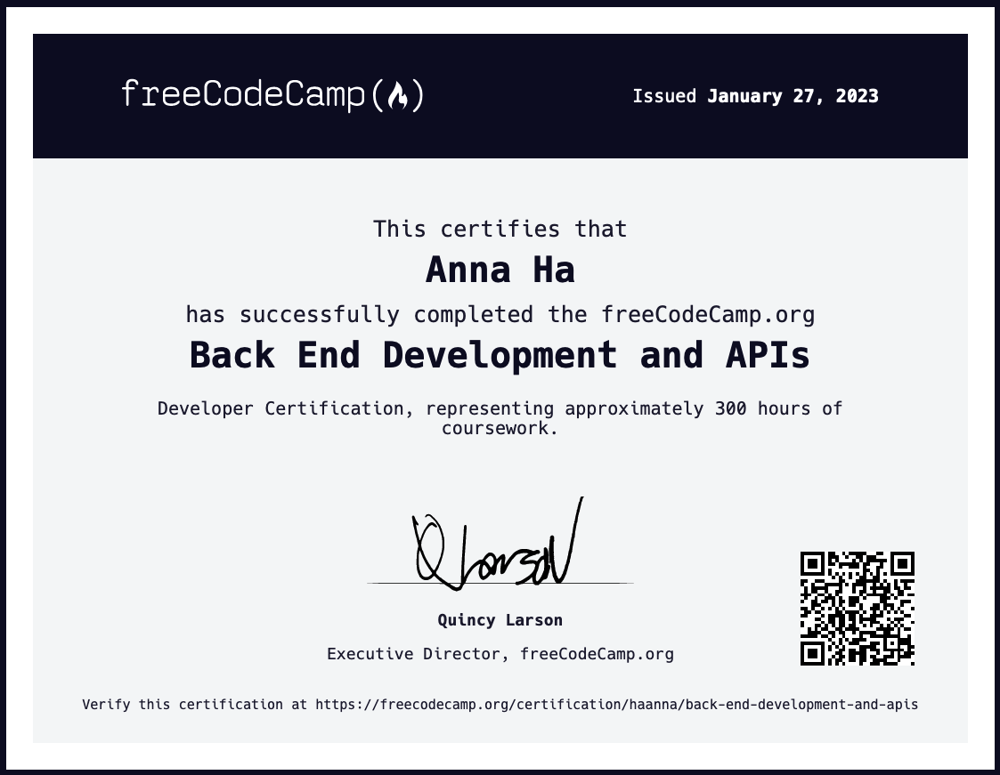

# Back End Development and APIs Course

Verify this certification at https://freecodecamp.org/certification/haanna/back-end-development-and-apis

## Table of contents

- [Overview](#overview)
  - [Links](#links)
- [My process](#my-process)
  - [Built with](#built-with)
  - [What I learned](#what-i-learned)
- [Author](#author)
- [Acknowledgments](#acknowledgments)

## Overview

All project that I've completed and that are part of the FreeCodeCamp's Back End Development and APIs course can be found here.

### Links

1. [Timestamp microservice](https://github.com/ha-anna/EDU_freeCodeCamp-Backend/tree/main/project-timestamp)  
2. [Url shortener](https://github.com/ha-anna/EDU_freeCodeCamp-Backend/tree/main/project-urlshortener)  
3. [Headparser](https://github.com/ha-anna/EDU_freeCodeCamp-Backend/tree/main/project-headerparser)  
4. [Exercise tracker](https://github.com/ha-anna/EDU_freeCodeCamp-Backend/tree/main/project-exercisetracker)  
5. [File metadata](https://github.com/ha-anna/EDU_freeCodeCamp-Backend/tree/main/project-filemetadata)  

## My process

More information about every project can be found in its folder's README.

### Built with

- HTML5
- CSS
- Vanilla JavaScript
- MongoDB
- Node.js
- Express.js
- Mongoose
- Cors

### What I learned

Using MongoDB to store and retrieve data, use Node to setup backend to communicate with frontend. Write POST and GET requests and use API.

## Author

- Website - [Ha Anna](https://haanna.com)
- Codepen.io - [@haanna](https://codepen.io/haanna)

## Acknowledgments

Thanks Free Code Camp for delivering all those lessons and great projects!
